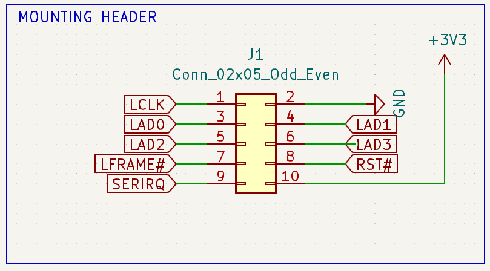
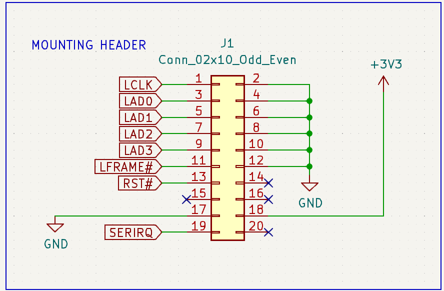

# LPC TPM module

TPM module PCB project for platforms with 2x5 pin, 2.54mm pitch LPC header
and 2x10 pin, 2.54mm pitch LPC header compatible with PC Engines platforms.

## Description

Trusted Platform Module compatible with:

1. 2x5pin LPC header populated on:
  * PC Engines apu3 platforms (from apu3d revision and onwards)
  * PC Engines apu4 platforms (from apu4c revision and onwards)
  * PC Engines apu6 platforms (all revisions)
2. 2x10pin LPC header populated on:
  * PC Engines apu2 platforms (all revisions)
  * PC Engines apu1 platforms (all revisions).

Design based on original [PC Engines TPM1A](https://pcengines.ch/schema/tpm1a.pdf).

TPM module can be used for:

* disk encryption
* password protection
* platform integrity and other security issues

TPM module features:

* TPM Infineon SLB9665TT2.0
* Operating voltage 3-3.3V
* Meeting Intel TXT, Microsoft Windows and Google Chromebook certification
  criteria for successful platform qualification
* True Random Number Generator (TRNG)
* Full personalization with Endorsement Key (EK) and EK certificate
* Supports the LPC interface

## Pinout

The pin layout is compatible with PC Engines platforms:

1. 2x5pin LPC header:

  

2. 2x10pin LPC header:

  

## License

* Hardware is licensed under [CERN license](LICENSE.txt)
* Documentation is licensed under [CC BY-SA license](https://creativecommons.org/licenses/by-sa/2.0/)

## Where can I buy this product?

If you are not the enthusiast of DYI, then the plug and play product can be
bought in the [3mdeb shop](https://shop.3mdeb.com/shop/modules/).